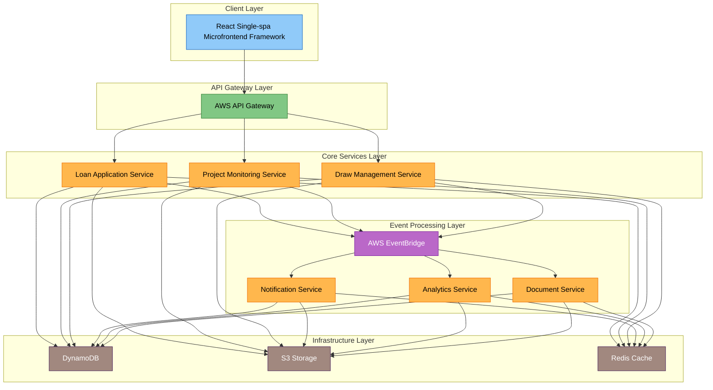

ConstructionLendPro Technical Implementation Documentation

## System Architecture Overview

ConstructionLendPro implements a cloud-native microservices architecture designed specifically for construction loan management. The system leverages AWS infrastructure to provide scalability, reliability, and security while maintaining loose coupling between components.

### High-Level Architecture

The system architecture consists of several interconnected layers, each serving distinct purposes in the construction loan lifecycle:

The architecture diagram illustrates the system's layered approach:

- The Client Layer provides a unified interface through React Single-spa microfrontend framework
- API Gateway acts as the entry point, routing requests to appropriate services
- Core Services handle business logic independently but coordinate through EventBridge
- Event Processing Layer enables asynchronous communication and system extensibility
- Infrastructure Layer provides persistence, caching, and storage capabilities

### Technology Stack

#### Frontend

- **Framework**: React 18.x with TypeScript
  - Single-spa for microfrontend implementation
  - Strict TypeScript configuration for type safety
  - ESLint with custom rules for code quality

- **State Management**: Redux Toolkit
  - Centralized state store
  - Async action handling
  - Immutable state updates

- **API Communication**: Apollo Client
  - GraphQL queries and mutations
  - Automatic retry mechanisms
  - Response caching strategies

- **UI Components**: Custom component library with Material-UI base
  - Consistent design system
  - Reusable component patterns
  - Accessibility compliance

#### Backend

- **Framework**: Nest.JS with TypeScript
  - Modular architecture 1:2
  - Dependency injection support
  - Built-in testing utilities

- **API Implementation**:
  - GraphQL with Apollo Server
    - Schema-first development approach
    - Query optimization
    - Error handling middleware

  - REST endpoints for specific services
    - Resource-based routing
    - Request validation
    - Response formatting

- **Database**: Amazon DynamoDB
  - NoSQL document-oriented storage
  - Global Secondary Indexes for efficient queries
  - Transaction support for consistency

#### Infrastructure & DevOps

- **Cloud Provider**: AWS
  - Multi-region deployment strategy
  - Well-Architected Framework compliance
  - Cost optimization practices

- **Containerization**: Docker
  - Container lifecycle management
  - Multi-stage builds
  - Resource optimization

- **Orchestration**: Kubernetes (EKS)
  - Horizontal Pod Autoscaling
  - Self-healing capabilities
  - Rolling updates

- **CI/CD Pipeline**: GitHub Actions
  - Automated testing workflows
  - Infrastructure provisioning
  - Deployment automation 1:8

Let me continue with the detailed implementation sections...
